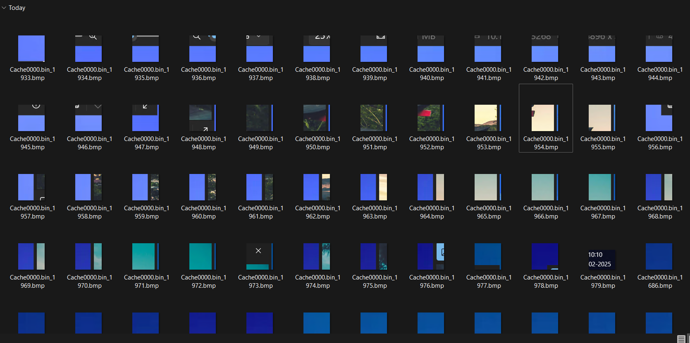

# Phantom Connection #
 
## Overview ##
 
Score: Like a fleeting dream, a connection once existed but has faded into the void. Only shadows of its presence remain. Can you bring it back to light?
 
## Description ##
 
Given a weird image.

## Hint ##
A .bin file
None

## Tool ##
- bmc-tools 

## Solution ##
A zip contains Cache0000.bin file and a .bmc file. I tried to mount the .bin file to inspect but it's corrupted.  
Looking online for .bmc tool and I found this: https://github.com/ANSSI-FR/bmc-tools.  
Simply clone the tools and use the following command:  
```bash
./bmc-tools.py -s ../Cache0000.bin -d extracted/
```  
In the extracted folder, a lot of images can be seen:  
  
Scrolling down, I found the flag but it was blur:  
  
Keep Scrolling down and the full flag should be seen:  
  
Combining the charracter and the flact is there:  
Flag: apoorvctf{CAcH3_Wh4T_YoU_sE3}
