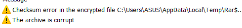
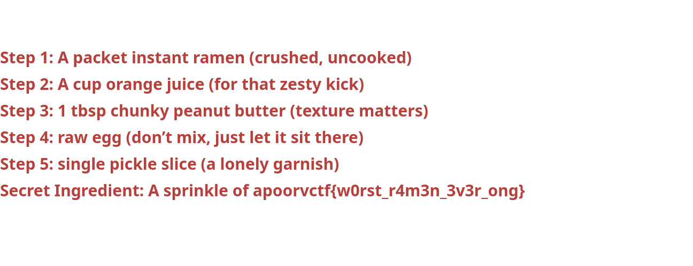

# Ramen Lockdown #
 
## Overview ##
 
Score: 414
 
## Description ##
 
A criminal mastermind named larry stole Chef Tataka ultimate ramen recipe and yeeted it into a password-protected zip file. Inside? A sacred file with the secret to flavor nirvana. Crack the zip, save the slurp. No pressure. 🍜💀

## Hint ##

None

## Tool ##
- bkcrack

## Solution ##
A protected zip file is given. Inside the .zip there is a secret_recipe.png file. I tried some of these passwords:  
- larry
- Tataka
- ramen
- slurp
- secret_recipe  
Trying the secret_recipe password, it says:  
  
So the zip is encrypted. Check the encryption method of the .zip file, we found the information below:  
```bash
└─$ zipinfo -v recipe.zip
Archive:  recipe.zip
There is no zipfile comment.

End-of-central-directory record:
-------------------------------

  Zip archive file size:                     90008 (0000000000015F98h)
  Actual end-cent-dir record offset:         89986 (0000000000015F82h)
  Expected end-cent-dir record offset:       89986 (0000000000015F82h)
  (based on the length of the central directory and its expected offset)

  This zipfile constitutes the sole disk of a single-part archive; its
  central directory contains 1 entry.
  The central directory is 87 (0000000000000057h) bytes long,
  and its (expected) offset in bytes from the beginning of the zipfile
  is 89899 (0000000000015F2Bh).


Central directory entry #1:
---------------------------

  secret_recipe.png

  offset of local header from start of archive:   0
                                                  (0000000000000000h) bytes
  file system or operating system of origin:      Unix
  version of encoding software:                   3.0
  minimum file system compatibility required:     MS-DOS, OS/2 or NT FAT
  minimum software version required to extract:   1.0
  compression method:                             none (stored)
  file security status:                           encrypted
  extended local header:                          yes
  file last modified on (DOS date/time):          2025 Feb 24 18:37:30
  file last modified on (UT extra field modtime): 2025 Feb 24 20:07:30 local
  file last modified on (UT extra field modtime): 2025 Feb 24 13:07:30 UTC
  32-bit CRC value (hex):                         89119f09
  compressed size:                                89808 bytes
  uncompressed size:                              89796 bytes
  length of filename:                             17 characters
  length of extra field:                          24 bytes
  length of file comment:                         0 characters
  disk number on which file begins:               disk 1
  apparent file type:                             binary
  Unix file attributes (100644 octal):            -rw-r--r--
  MS-DOS file attributes (00 hex):                none

  The central-directory extra field contains:
  - A subfield with ID 0x5455 (universal time) and 5 data bytes.
    The local extra field has UTC/GMT modification/access times.
  - A subfield with ID 0x7875 (Unix UID/GID (any size)) and 11 data bytes:
    01 04 e8 03 00 00 04 e8 03 00 00.

  There is no file comment.
```  
In the given information, pay attention to these:  
```bash
compression method:                             none (stored)
minimum software version required to extract:   1.0
```
The file is stored (not compressed), which is good for bkcrack because the encrypted bytes directly match the original file bytes.  
Also, the minimum software version of this zip is 1.0, while stronger encryption such as AES-encrypted zip will require 2.0+ version.  
Looking online for .zip tool, I found bkcrack: https://github.com/Skriep/CTF-Crypto-bkcrack  
Since we know the first 12 bit of a png file:
```bash
echo -ne '\x89\x50\x4E\x47\x0D\x0A\x1A\x0A\x00\x00\x00\x0D\x49\x48\x44\x52' > header.bin
```
Now, use bkcrack with the bin:
```bash
└─$ ./bkcrack -C recipe.zip -c secret_recipe.png -p header.bin
bkcrack 1.5.0 - 2025-03-01
[15:13:10] Z reduction using 9 bytes of known plaintext
100.0 % (9 / 9)
[15:13:10] Attack on 721680 Z values at index 6
Keys: 7cfefd6a 4aedd214 970c7187
41.3 % (297841 / 721680)
[15:15:57] Keys
7cfefd6a 4aedd214 970c7187
```
Now, we have 3 keys, which is the internal password representation. Finally:  
```bash
./bkcrack -C recipe.zip -c secret_recipe.png -k 7cfefd6a 4aedd214 970c7187 -d hi.png
```
And we got the flag:  


