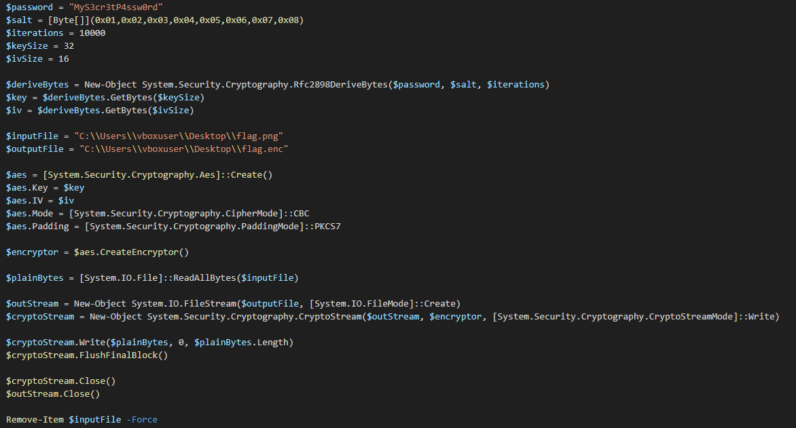
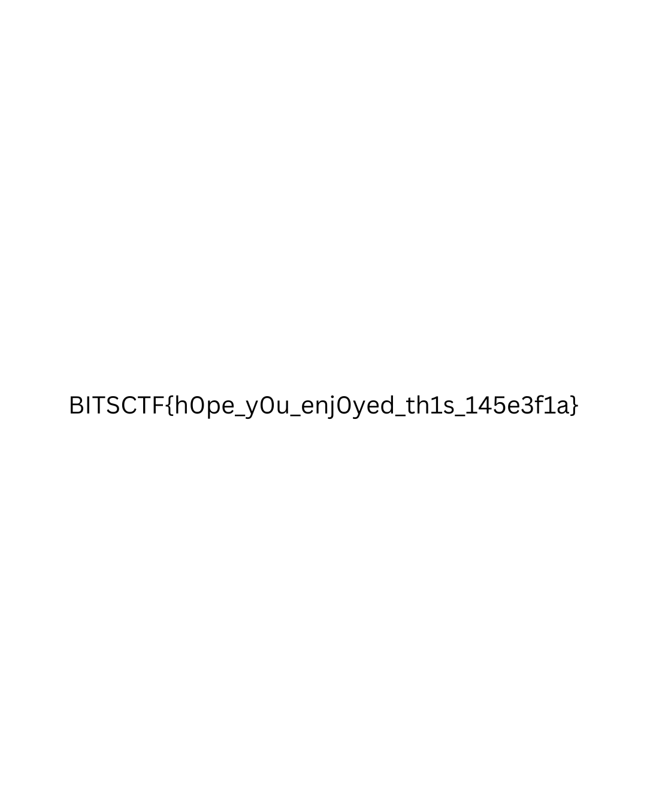

# Virus Camp 1 #
 
## Overview ##
 
Score: 212
 
## Description ##
 
Can you now get the contents of the flag as well?

## Hint ##
None

## Tool ##
FTK Imager
 
## Solution ##
Continue with the exetnsion.js file, this block of code is the main part I investigate.  
To begin with, I can see that that the script content is encoded with base64 and then it got reversed. I can see it here through the red code line:  


First thing I do is to reverse the character and then decode it with base64:  
```bash
echo <the base64 encoded script> | base64 --decode
```
Now we have the full script:    


It can be seen that the flag.enc is encrypted with AES algorithm. All I have to do is to write a simple script to decrypt it:
```bash
from Crypto.Cipher import AES
from Crypto.Protocol.KDF import PBKDF2
import os

password = b"MyS3cr3tP4ssw0rd"
salt = bytes([0x01, 0x02, 0x03, 0x04, 0x05, 0x06, 0x07, 0x08])
iterations = 10000
key_size = 32
iv_size = 16

# Derive key and IV from password and salt
key_iv = PBKDF2(password, salt, dkLen=key_size + iv_size, count=iterations)
key = key_iv[:key_size]
iv = key_iv[key_size:key_size + iv_size]

input_file = "flag.enc"
output_file = "flag_decrypted.png"

# Read encrypted data
encrypted_data = open(input_file, "rb").read()

# Initialize AES cipher
aes = AES.new(key, AES.MODE_CBC, iv)

# Decrypt the data
decrypted_data = aes.decrypt(encrypted_data)

# Remove padding (PKCS7)
padding_length = decrypted_data[-1]
if padding_length > 0 and padding_length <= iv_size:
    decrypted_data = decrypted_data[:-padding_length]

# Write the decrypted file
with open(output_file, "wb") as file_out:
    file_out.write(decrypted_data)
```   
The flag should be printed out as an image:  


