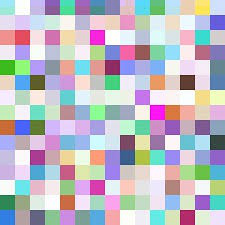
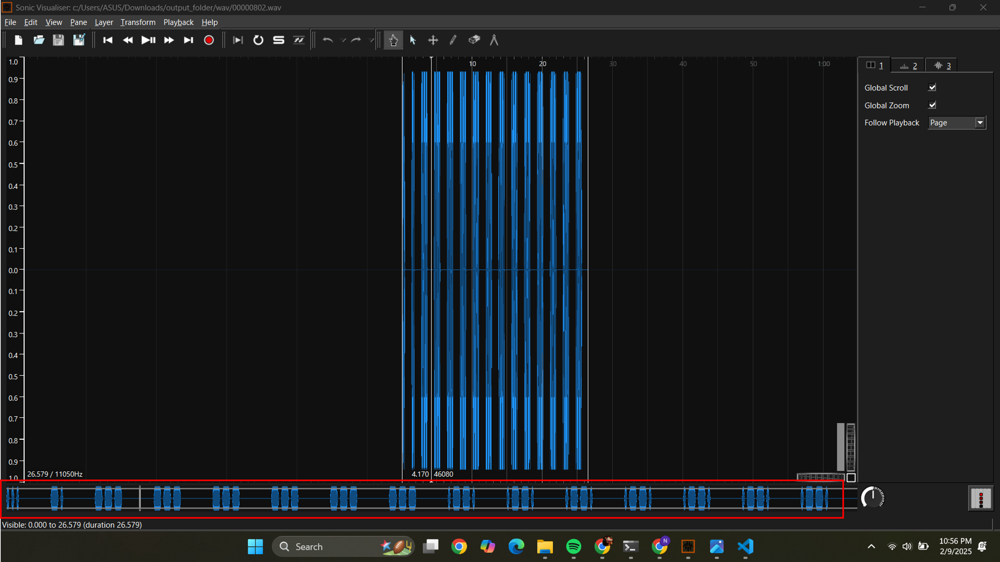

# Keeper_Finder #
 
## Overview ##
 
Score:
 
## Description ##
 
Given a weird image.

## Hint ##

None

## Tool ##
Foremost
Steghide
 
## Solution ##
I was given an image. I used foremost to extract the hidden files within the image:
```bash
$ foremost -i file
```
Check the output folder, I have three folders: jpg, png and wav.  
The jpg picture:  

Maybe I can do something with this image?  
  
The png picture  
  
It's weird.png. I dont think there is anything with this.  
This comes down to the wav file - my biggest evidence. I open the wav file in Sonic Visualiser and find out that this is a Morse Code.

Decoding we have snooooooppppppp.  
At first I thought it was the flag and keep submitting but failed. Then I try to form a meaning word with those letters but at the end, this is the passphrase for the jpg file!  
Return to our jpg image, I use Steghide and enter the hashphrase:  
```bash
steghide extract -sf 00000144.jpg
```
When the extraction is complete, the flag is found in the new folder.  
Flag: BITSCTF{1_4m_5l33py_1256AE76}