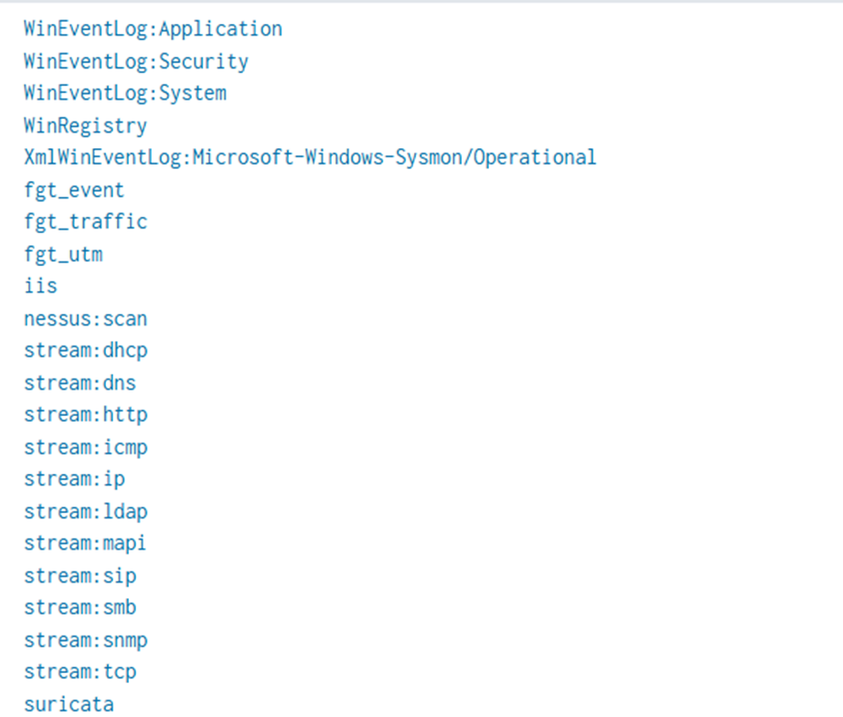
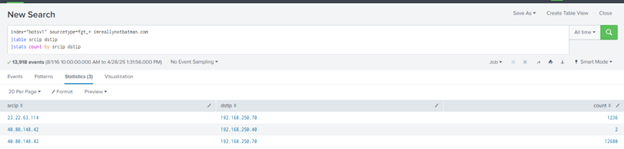
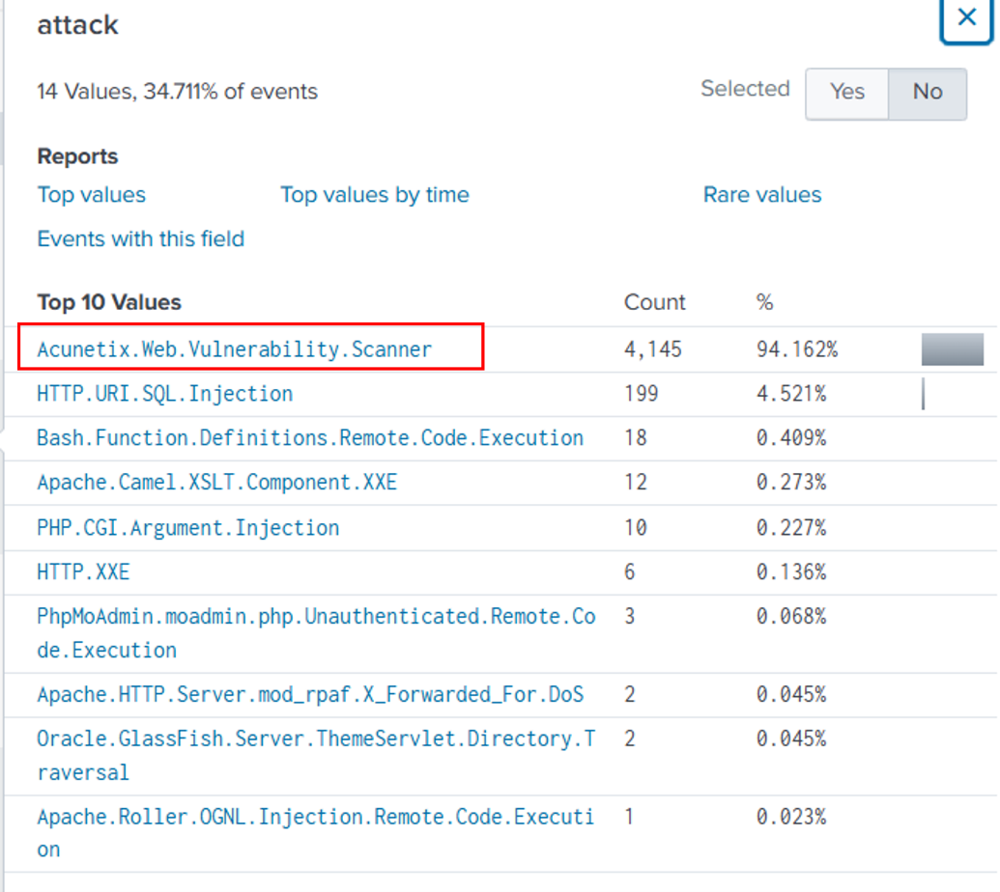
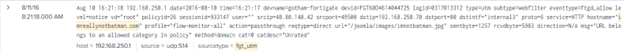
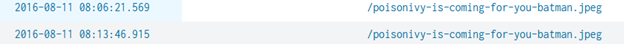
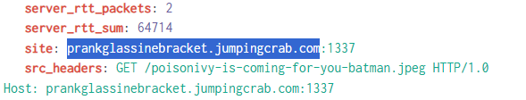
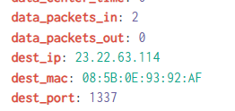
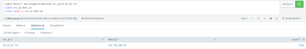
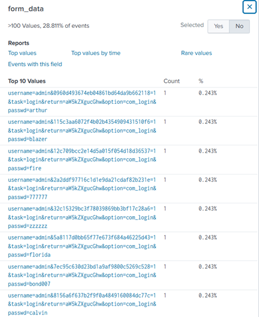

# Boss of the SOC Version 1 (2015) #
 
## Overview ##
Blue Team Lab. Really enjoyed.
 
## Description ##  

Today is Alice's first day at the Wayne Enterprises' Security Operations Center. Lucius sits Alice down and gives her first assignment: A memo from Gotham City Police Department (GCPD). Apparently GCPD has found evidence online (http://pastebin.com/Gw6dWjS9) that the website www.imreallynotbatman.com hosted on Wayne Enterprises' IP address space has been compromised. The group has multiple objectives... but a key aspect of their modus operandi is to deface websites in order to embarrass their victim. Lucius has asked Alice to determine if www.imreallynotbatman.com. (the personal blog of Wayne Corporations CEO) was really compromised.

## Hint ##  
- Some. I don't really remember XD

## Tool ##
- Splunk
- VirusTotal

## Solution ##
1. What is the likely IPv4 address of someone from the Po1s0n1vy group scanning imreallynotbatman.com for web application vulnerabilities?  
Let’s see what type of data that we can start with:
```text
|metadata index="botsv1" type=sourcetypes 
| stats values(sourcetype)
```
Here we have the result:  
<p align="center">
  
</p>


From the sourcetype, let’s start with the Fortigate firewall:  
```text
index="botsv1" sourcetype=fgt_* imreallynotbatman.com 
|table src_ip dst_ip
|stats count by src_ip dst_ip
```  
This query will find activities where the domain **imreallynotbatman** appears:  
<p align="center">
  
</p>
**Answer: 40.80.148.42**  

2. What company created the web vulnerability scanner used by Po1s0n1vy? Type the company name.  
Follow the 40.80.148.42 IP, view the attack event and we can find the vuln scanner:   
<p align="center">
  
</p>

**Answer: Acunetix**  

3. What content management system is imreallynotbatman.com likely using?  
Look at the event table and the CMS should be there:  


**Answer: joomla**  

4. What is the name of the file that defaced the imreallynotbatman.com website? Please submit only the name of the file with extension.  
Defacing means the image or graffiti that ruins the surface of something. Maybe an image extension can help in this situation. Since we already know the Web Server IP is **192.168.250.70**. Let’s dive more into this IP:  
```text
index="botsv1" sourcetype="stream:http" "192.168.250.70"
| search uri=*
| where like(uri, "%.jpg") OR like(uri, "%.jpeg")
| table _time src_ip dst_ip uri
```
Looking all the image files and eventually the file name can be found:  
  

5. This attack used dynamic DNS to resolve to the malicious IP. What fully qualified domain name (FQDN) is associated with this attack?  
A fully qualified domain name (FQDN) is the complete address of an internet host or computer. It provides its exact location within the domain name system (DNS) by specifying the hostname, domain name and top-level domain (TLD). For example, for the domain name www.whatis.com, "www" is the hostname, "whatis" is the domain name and ".com" is the top-level domain.  
View the event that contain the .jpeg, the FQDN can be found easily:
  
***Answer: prankglassinebracket.jumpingcrab.com**

6. What IPv4 address has Po1s0n1vy tied to domains that are pre-staged to attack Wayne Enterprises?
The phrase "pre-staged domain" typically refers to domains that have been **set up in advance** by attackers for a future malicious purpose. These domains are often registered or configured ahead of time for later exploitation in a cyberattack.  
Still inside the event, the IP for this question can be found:  
  

7. What IPv4 address is likely attempting a brute force password attack against imreallynotbatman.com?
When an attacker tried to brute force attack a website, the sent request is a POST request. As we have a new pre – staged ip **23.22.63.114**, let’s dive deeper into the activity of this IP:
```text
index="botsv1" sourcetype=stream:http src_ip=23.22.63.114
|table src_ip dest_ip
|stats count by src_ip dest_ip
```
  
Total of 1430 activities. Let’s see what this IP is up to.  
In the event view, in the form data section:  
  
We can see that the IP repeatedly tries the username admin with different passwords. This is the IP that we need.  

8. What is the name of the executable uploaded by Po1s0n1vy?
