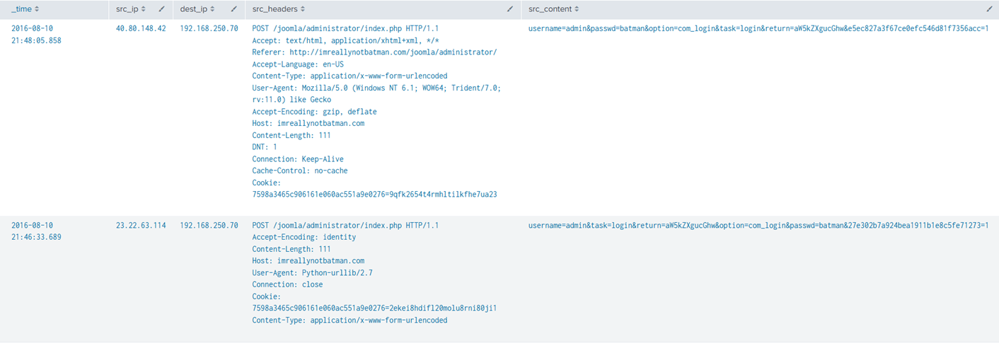

# Boss of the SOC Version 1 (2015) #
 
## Overview ##
Blue Team Lab. Really enjoyed.
 
## Description ##  

Today is Alice's first day at the Wayne Enterprises' Security Operations Center. Lucius sits Alice down and gives her first assignment: A memo from Gotham City Police Department (GCPD). Apparently GCPD has found evidence online (http://pastebin.com/Gw6dWjS9) that the website www.imreallynotbatman.com hosted on Wayne Enterprises' IP address space has been compromised. The group has multiple objectives... but a key aspect of their modus operandi is to deface websites in order to embarrass their victim. Lucius has asked Alice to determine if www.imreallynotbatman.com. (the personal blog of Wayne Corporations CEO) was really compromised.

## Hint ##  
- Some. I don't really remember XD

## Tool ##
- Splunk
- VirusTotal

## Solution ##
1. What is the likely IPv4 address of someone from the Po1s0n1vy group scanning imreallynotbatman.com for web application vulnerabilities?  
Let’s see what type of data that we can start with:
```text
|metadata index="botsv1" type=sourcetypes 
| stats values(sourcetype)
```
Here we have the result:  
<p align="center">
  
</p>


From the sourcetype, let’s start with the Fortigate firewall:  
```text
index="botsv1" sourcetype=fgt_* imreallynotbatman.com 
|table src_ip dst_ip
|stats count by src_ip dst_ip
```  
This query will find activities where the domain **imreallynotbatman** appears:  
<p align="center">
  
</p>
**Answer: 40.80.148.42**  

2. What company created the web vulnerability scanner used by Po1s0n1vy? Type the company name.  
Follow the 40.80.148.42 IP, view the attack event and we can find the vuln scanner:   
<p align="center">
  
</p>

**Answer: Acunetix**  

3. What content management system is imreallynotbatman.com likely using?  
Look at the event table and the CMS should be there:  
<p align="center">
  
</p>

**Answer: joomla**  

4. What is the name of the file that defaced the imreallynotbatman.com website? Please submit only the name of the file with extension.  
Defacing means the image or graffiti that ruins the surface of something. Maybe an image extension can help in this situation. Since we already know the Web Server IP is **192.168.250.70**. Let’s dive more into this IP:  
```text
index="botsv1" sourcetype="stream:http" "192.168.250.70"
| search uri=*
| where like(uri, "%.jpg") OR like(uri, "%.jpeg")
| table _time src_ip dst_ip uri
```
Looking all the image files and eventually the file name can be found:  
<p align="center">
  
</p> 

5. This attack used dynamic DNS to resolve to the malicious IP. What fully qualified domain name (FQDN) is associated with this attack?  
A fully qualified domain name (FQDN) is the complete address of an internet host or computer. It provides its exact location within the domain name system (DNS) by specifying the hostname, domain name and top-level domain (TLD). For example, for the domain name www.whatis.com, "www" is the hostname, "whatis" is the domain name and ".com" is the top-level domain.  
View the event that contain the .jpeg, the FQDN can be found easily:
<p align="center">
  
</p> 

***Answer: prankglassinebracket.jumpingcrab.com**

6. What IPv4 address has Po1s0n1vy tied to domains that are pre-staged to attack Wayne Enterprises?
The phrase "pre-staged domain" typically refers to domains that have been **set up in advance** by attackers for a future malicious purpose. These domains are often registered or configured ahead of time for later exploitation in a cyberattack.  
Still inside the event, the IP for this question can be found:  
<p align="center">
  
</p>

7. What IPv4 address is likely attempting a brute force password attack against imreallynotbatman.com?
When an attacker tried to brute force attack a website, the sent request is a POST request. As we have a new pre – staged ip **23.22.63.114**, let’s dive deeper into the activity of this IP:
```text
index="botsv1" sourcetype=stream:http src_ip=23.22.63.114
|table src_ip dest_ip
|stats count by src_ip dest_ip
```
<p align="center">
  
</p>

Total of 1430 activities. Let’s see what this IP is up to.  
In the event view, in the form data section:  
<p align="center">
  
</p>

We can see that the IP repeatedly tries the username admin with different passwords. This is the IP that we need.  

8. What is the name of the executable uploaded by Po1s0n1vy?  
Looking for executable files, means that .exe, .bat, .ps1. To confirm which OS the Wayne Enterprise use, in the previous search, it already showed.
<p align="center">
  
</p>

Server: Microsoft – IIS. Let’s look for a .ps1 and a .exe file:
```text
index="botsv1" sourcetype="fgt_*" srcip="23.22.63.114" (file_name="*.exe" OR file_name="*.ps1")
| table _time srcip dstip file_name
```
<p align="center">
  
</p>  

There is no executable for this IP. Let’s try for 40.80.148.42:
<p align="center">
  
</p>  

**Answer: 3791.exe**  

9. What is the MD5 hash of the executable uploaded?  
View the event contain the .exe and we should be able to find the hash of the .exe. But this is the SHA256 hash:  
  
Let’s upload it to virustotal and what’s the file:  
  
The file looks fun. Anyway we have our MD5 hash this question.  

10. What was the first brute force password used?
From the previous brute force question, we already know the src_content for this is “username=admin*”.  
Let’s look for first password using this:  
```text
index="botsv1" sourcetype=stream:http src_content="username=admin*"
| table _time, src_ip, dest_ip, src_content
| sort _time
```
  

11. One of the passwords in the brute force attack is James Brodsky's favorite Coldplay song. We are looking for a six character word on this one. Which is it?  
Continue with the password query, add the rex field to search for only the password with 6 characters:  
```text
index="botsv1" sourcetype=stream:http src_content="username=admin*"
| rex field=src_content "passwd=(?P<passwd>[^&]+)"
| where len(passwd) = 6
| table passwd
| sort _time
```  
This captures everything after passwd= until it hits the next & or end of the string. The [^&]+ matches one or more characters that are not &, ensuring that it captures the full password even if there are special characters like +, &, or spaces in the password field.  
From here, we should get the list of passwords:  
  
But which is the Coldplay song? According to Wikipedia, there are some 6 – character – word song such as Sparks, Shiver, Yellow. In the list, there is yellow. We found it. 

12. What was the correct password for admin access to the content management system running "imreallynotbatman.com"?  
If the access is complete, it means that the brute force will stop. From this, we can find what is the correct password with the timestamp:  
```text
index="botsv1" sourcetype=stream:http src_content="username=admin*"
| rex field=src_content "passwd=(?P<passwd>[^&]+)"
| table _time, passwd, src_content
| sort _time
```

**Answer: batman**

13. How many seconds elapsed between the time the brute force password scan identified the correct password and the compromised login?
I took a while to understand the question. There are two IPs: **23.22.63.114** and **40.80.148.42**. A brute force attack was launched on Joomla Admin login page. The **23.22.64.114** is responsible for the brute force attack. After getting the correct password, the attacker did not continue from the same IP. Instead, he moved to the **40.80.148.42** to login the page. To find the correct timestamp, use the querry:  
```text
index="botsv1" sourcetype=stream:http  src_content=username* AND src_content=*batman*
| table _time src_ip dest_ip src_headers src_content
```  
  
We should be able to get the timestamp. The elapsed seconds is 92.17 seconds.  

14. How many unique passwords were attempted in the brute force attempt?  
This one is easy. Simply add dedup passwd and we are done:
 

15. What special hex code is associated with the customized malware discussed in question 111?  
Upload the hash to virustotal and we got this:  
  
Scrolling to the community tab and there is the hex XD (The intended way is to upload)

16. GCPD reported that common TTPs (Tactics, Techniques, Procedures) for the Po1s0n1vy APT group, if initial compromise fails, is to send a spear phishing email with custom malware attached to their intended target. This malware is usually connected to Po1s0n1vys initial attack infrastructure. Using research techniques, provide the SHA256 hash of this malware.    
Upload the IP to VirusTotal and look at the Relations tab:  
  
MirandaTateScreensaver.scr.exe? This could be the Delivery Phase in the kill chain in case they failed to brute force the web server.  
  

17. What was the average password length used in the password brute forcing attempt?  
As the hint:
- Calculate the length of every password attempt and store the result in a new field. Then calulate the average of that new field with a stats command. Use eval to average, or just visually inspect.  
- Then calulate the average of that new length field with a stats command, and finally use eval to round, or just manually round.  
We have the following query:  
```text
index="botsv1" sourcetype=stream:http src_content="username=admin*"
| rex field=src_content "passwd=(?P<passwd>[^&]+)"
| eval passwd_length=len(passwd) 
| stats avg(passwd_length) as avg_password_length
| eval avg_password_length=round(avg_password_length)
```  
  

## Conclusion ##
The investigation can be summerized into cyber kill chain as below:
- Reconnaissance: The IP 40.80.148.42 run a vuln scan on the web server 192.168.250.70 using Acunetix.
- Weaponisation: Attacker Infrastructure can be found within the IP that is used for the brute force attack 23.22.63.114:
  
- Delivery: When Po1s0n1vy can't hack you one way, they send a very targeted phishing email with custom malware that connects to their servers so they can still take over your system. In this scenario, it is the MirandaTateScreensaver.scr.exe. In case the exploitation phase failed, this will be how the attacker get the credentials of the server’s administrator. If the brute force exploitation phase succeeds,  insalling malware may give you total system control.
- Exploitation: The attacker will now used the “bait” IP, which is 23.22.63.114, to attack the server. After getting the correct password. The original attacker IP 40.80.148.42 will login to the admin page.
- Installation: Now that the exploitation is complete, poisonivy upload 3791.exe to fully qualified the domain name .
- Command & Control: FQDN is now on: prankglassinebracket.jumpingcrab.com to deface the system.
- Actions on Objectives: The result is the file that defaced the web server, the .jpeg file.

