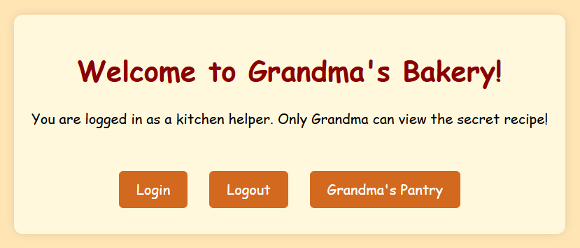
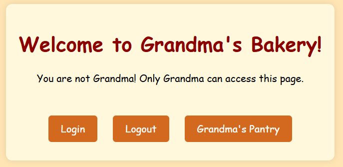
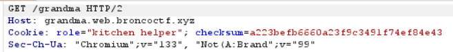

# Grandma's Secret Recipe #
 
## Overview ##
 
Category: Web
Score: 10
 
## Description ##
Grandma has been baking her world-famous cookies for decades, but she’s always kept her secret recipe locked away. Nobody—not even her most trusted kitchen helpers—knows the full list of ingredients.  
She insists it’s all about "the perfect balance of love and a pinch of mystery", but deep down, you know there’s more to it. Rumors say only Grandma herself is allowed to see the recipe, hidden somewhere in her kitchen.  
But, you were hired by Grandpa, who divorced her because she refused to share the recipe. Can you figure out the true secret behind her legendary cookies? 🍪👵
## Hint ##

None

## Tool ##
- Burp Suite

## Solution ##
This is an easy web challenge. The website is shown as below:  
  
When I click on "Grandma's Pantry", it says:  
  
To access the pantry, simply use Burp Suite Proxy:  
  
Now, we need to change the role so access to the pantry as below (the checksum is md5):  
```bash
Cookie: role="grandma"; checksum=a5d19cdd5fd1a8f664c0ee2b5e293167
```  
Flag: bronco{grandma-makes-b3tter-cookies-than-girl-scouts-and-i-w1ll-fight-you-over-th@t-fact}


