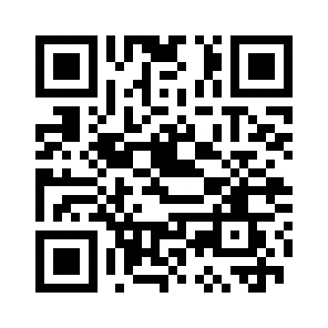
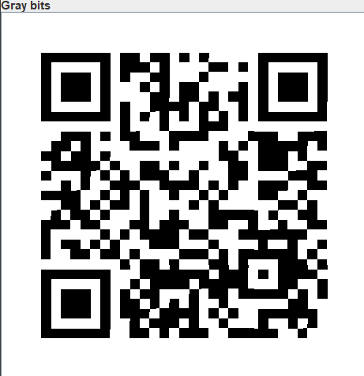

# QR Coded #
 
## Overview ##
 
Category: Forensics
Score: 277
 
## Description ##
 
This one should be really easy. All you have to do is scan a QR code!

## Hint ##

None

## Tool ##
- Stegsolve

## Solution ##
A QR code is given as below:  
  
First I scan the QR code (which didn't work eventually):  
```bash
└─$ zbarimg easy_scan.png
QR-Code:bracco{thi5_1sn7_r34l}
scanned 1 barcode symbols from 1 images in 0 seconds
```  
I use Exiftool and file to see if there is anything special and found nothing. Binwalk and Foremost couldn't find any hidden files in the image either. Seems like I must modify the QR code to find the flag.  
Using Stegsolve and I have this version of the QR code:  
  
Scan it again and I have the flag:  
```bash
└─$ zbarimg gray.png
QR-Code:bronco{th1s_0n3_i5}
scanned 1 barcode symbols from 1 images in 0.01 seconds
```


