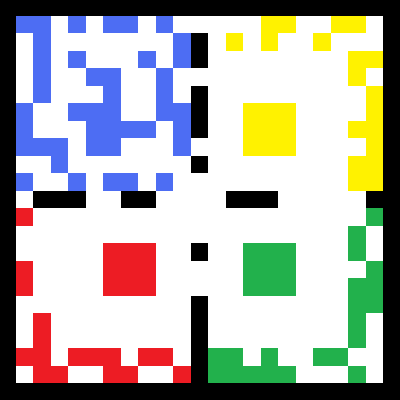
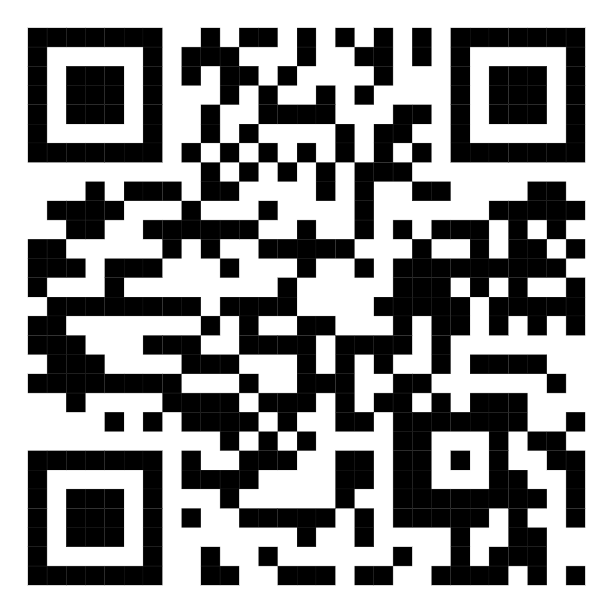
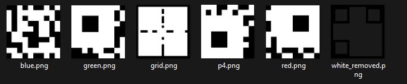
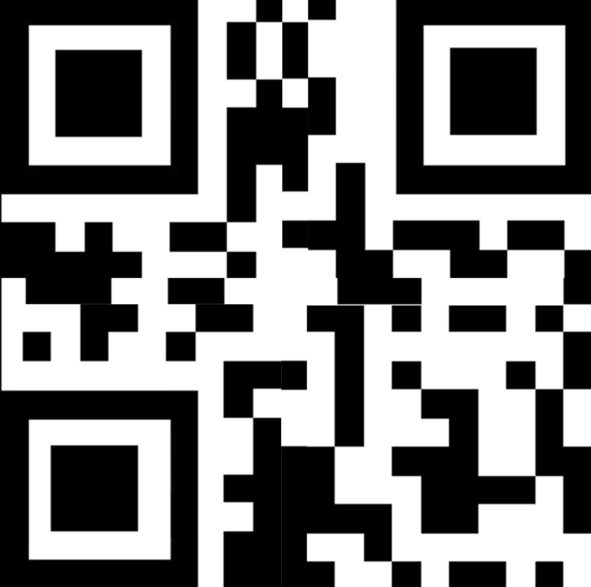

# Simon Says Scan This #
 
## Overview ##
 
Category: Forensics
Score: 436
 
## Description ##
 
Ugh.. another QR Code challenge. I guess I better do what the title says.

## Hint ##

None

## Tool ##
- MS Paint

## Solution ##
This QR code challenge is quite simple. We are given two parts:  
    
  
Comparing it with a QR code example:  
  
I can see that I have to flip the corners of the second part and reorder it to the same color order in the simon says game.   
I detached the part 2 image into 5 parts: blue, red, green, yellow and gridline as below:  
  
Combine it all together and crop the black border outside of the new QR, we have the following:  

Scan it and we should get the flag:  
```bash
└─$ zbarimg qr.png
QR-Code:bronco{0h_i_s33}
scanned 1 barcode symbols from 1 images in 0.04 seconds
```


