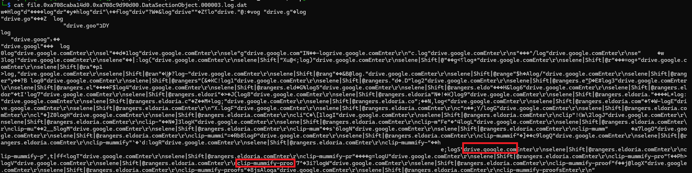

# Stealth Invasion #
 
## Overview ##
 
Score: 975
Category: Forensics
 
## Description ##  

Selene's normally secure laptop recently fell victim to a covert attack. Unbeknownst to her, a malicious Chrome extension was stealthily installed, masquerading as a useful productivity tool. Alarmed by unusual network activity, Selene is now racing against time to trace the intrusion, remove the malicious software, and bolster her digital defenses before more damage is done.

## Hint ##  
- None

## Tool ##
- Volatility

## Solution ##
A memory dump CTF. To pwn this challenge, we have to answer 6 questions:  
1. What is the PID of the Original (First) Google Chrome process?  
To answer this question, simply scan for the process information:  
```bash  
vol -f memdump.elf windows.pslist
PID     PPID    ImageFileName   Offset(V)       Threads Handles SessionId       Wow64   CreateTime      ExitTime        File output
4080    5296    chrome.exe      0xa708c729e0c0  48      -       1       False   2025-03-13 17:01:04.000000 UTC  N/A     Disabled
2736    4080    chrome.exe      0xa708c74560c0  11      -       1       False   2025-03-13 17:01:04.000000 UTC  N/A     Disabled
5688    4080    chrome.exe      0xa708c6cf4080  18      -       1       False   2025-03-13 17:01:04.000000 UTC  N/A     Disabled
7504    4080    chrome.exe      0xa708c6b19080  24      -       1       False   2025-03-13 17:01:04.000000 UTC  N/A     Disabled
1220    4080    chrome.exe      0xa708c7514080  9       -       1       False   2025-03-13 17:01:04.000000 UTC  N/A     Disabled
4612    4080    chrome.exe      0xa708c7230080  15      -       1       False   2025-03-13 17:01:05.000000 UTC  N/A     Disabled
8036    4080    chrome.exe      0xa708caec6080  13      -       1       False   2025-03-13 17:01:08.000000 UTC  N/A     Disabled
1368    4080    chrome.exe      0xa708c6594080  14      -       1       False   2025-03-13 17:01:11.000000 UTC  N/A     Disabled
```
**Answer:** The PID of the first Google Chrome process is **4080**  
2. What is the only Folder on the Desktop?  
In this question, I scan for any object that present "Desktop" and look for the folder in the Desktop:  
```bash
vol -f memdump.elf windows.filescan | grep -i desktop
```  
Among the ouput result, the only folder can be found with a little scroll down:  
```bash
0xa708c8d9ec30  \Users\selene\Desktop\malext\background.js
0xa708c8d9fef0  \Users\selene\Desktop\malext\manifest.json
0xa708c8da14d0  \Users\selene\Desktop\malext\rules.json
0xa708c8da1e30  \Users\selene\Desktop\malext\content-script.js
```
**Answer:** The folder name is **malext**  
3. What is the Extention's ID (ex: hlkenndednhfkekhgcdicdfddnkalmdm)?   
Simply scan for the answer with the grep extension:  
```bash
vol -f memdump.elf windows.filescan | grep -i extension
```
In the result, there are plenty of extension's ID:  
```bash
jmjflgjpcpepeafmmgdpfkogkghcpiha
nnjofihdjilebhiiemfmdlpbdkbjcpae
```
**Answer:** Extension's ID is **nnjofihdjilebhiiemfmdlpbdkbjcpae**  
4. After examining the malicious extention's code, what is the log filename in which the data is stored?  
Now we have the extension's ID, things will get a lot easier. Scan for any evidence that has the ID provided:  
```bash
└─$ vol -f memdump.elf windows.filescan | grep -i nnjofihdjilebhiiemfmdlpbdkbjcpae
0xa708c8830c80.0\Users\selene\AppData\Local\Google\Chrome\User Data\Default\Local Extension Settings\nnjofihdjilebhiiemfmdlpbdkbjcpae\LOG
0xa708c8dd5be0  \Users\selene\AppData\Local\Google\Chrome\User Data\Default\Local Extension Settings\nnjofihdjilebhiiemfmdlpbdkbjcpae\MANIFEST-000001
0xa708c8dda230  \Users\selene\AppData\Local\Google\Chrome\User Data\Default\Local Extension Settings\nnjofihdjilebhiiemfmdlpbdkbjcpae\CURRENTdbtmp
0xa708c8f2b500  \Users\selene\AppData\Local\Google\Chrome\User Data\Default\Local Extension Settings\nnjofihdjilebhiiemfmdlpbdkbjcpae
0xa708c8f2d760  \Users\selene\AppData\Local\Google\Chrome\User Data\Default\Local Extension Settings\nnjofihdjilebhiiemfmdlpbdkbjcpae
0xa708cab9a2c0  \Users\selene\AppData\Local\Google\Chrome\User Data\Default\Local Extension Settings\nnjofihdjilebhiiemfmdlpbdkbjcpae\LOG
0xa708caba14d0  \Users\selene\AppData\Local\Google\Chrome\User Data\Default\Local Extension Settings\nnjofihdjilebhiiemfmdlpbdkbjcpae\000003.log
```
And there we go. We got the log filename.  
**Answer:** The log filename is **000003.log**  
5. What is the URL the user navigated to?  
Now that we have the log. Let's extract it to a folder and view it from the computer:  
```bash
vol -f memdump.elf -o dump windows.dumpfiles --virtaddr "0xa708caba14d0"
```  
Inside the logfile:
  
We can see the first URL that the user was navigated to drive.google.com  
**Answer:** URL is **drive.google.com**  
6. What is the password of selene@rangers.eldoria.com?  
In the same log, look around the Enter and we should get the answer
**Answer:** Password is **clip-mummify-proofs**