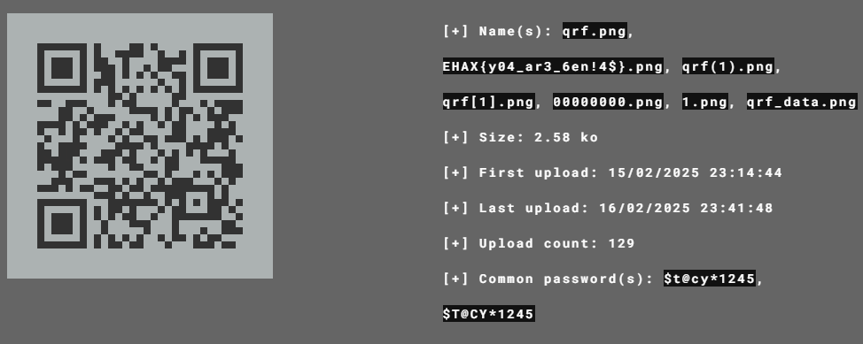

# Tracks #
 
## Overview ##
Category: Forensics

## Description ##
"The Track Not Taken"

## Hint ##
None

## Tool ##
- Exiftool
- Stegsolve    
- Foremost  
- Aperi'Solve  

## Solution ##
I was given a phineas and ferb opening video. There are no clues in the video.  
To begin with, I used exiftool and file to see if there are any clues and there are none. This means that files are hidden within the video.  
Extracting the video with Foremost:
```bash
foremost -i chall.mp4
```   
In the output folder, there should be:
- A locked zip file contains a flag.txt. This could be the flag.  
- A zip file contains a qr code.  
I scanned the qr code using zbarimg:
```bash
└─$ zbarimg qrf.png
QR-Code:not every qr code should be scanned
scanned 1 barcode symbols from 1 images in 0.01 seconds
```
Seems like we have to find another way to find the password for the zip. From here, there are two approaches:
1. Use stegsolve (the intended way):  
Using stegsolve, we can find the password for the zip:  
  
2. Use Aperi'Solve:  
Upload the image to Aperi'Solve and you should get the password:  
  
After


