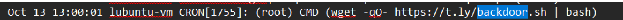

# One Way Room #
 
## Overview ##
 
Score: 150
 
## Description ##  

It's a basic disk forensic. Download the attachment, and fill in the answers to get flag

## Hint ##  

None

## Tool ##
- LinuxReader
- John the Ripper

## Solution ##
This is a basic disk forensic. You are given a disk file. To get the flag, answer these questions:  
  
You can install the disk on any hypervisor you like, in this case I use Virtual Box Before getting to the disk image installation step, I used Linux Reader to check if there are any lost files to restore and it is more convenient to find on Windows for me using Ctrl + F.  
After installing the program, I analyze the disk and answer the question:  
**Backdoor URL:** This is a link and eventually we find this in /var/log. Usually there is an apache2 folder to check but it didn’t exist in the disk, so I had to check for another file. I checked the syslog file and luckily it was the file I need. I downloaded the file to window and searched for the keyword such as backdoor, wget, etc.  
  
**Answer:** https://t.ly/backdoor.sh  
**IP of Login attempt:** To answer this question, look for the answer in the auth.log since this is the file that contains authentication – related events on the system. Look for the keywords which related to the question such as: authentication, failed, failure, denied, access and so on. After going through all keywords, the IP is:  
  
This might be the answer I needed. This looks like a login script from the msfconsole.  
**Answer:** 192.166.246.54  
**UUID of /dev/sda1:** Use command and we got the answer:
```bash
blkid /dev/sda1
```
**Answer:**  
  
**Password for user very-secure:** Check the hash in /etc/shadow and we found the following hash: very-secure:$1$icecream$BFNWlq61bRSp1IX4spIAR.  
With the hash, use John the Ripper to crack the password:  
  
We got the credentials for both users in the machine.  
**Deleted file flag:** Open the recycle bin and recover the file. The flag should be there.  
**Answer:**  
  
Flag: hkcert24{h4v3_4_t4st3_0f_1inux_f0r3nsic_0r_b3ing_rickr011_4g4in}