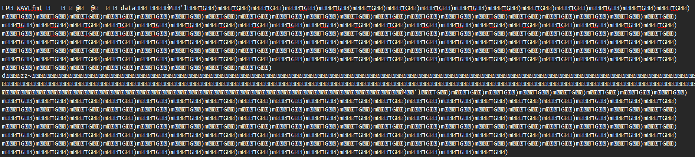

# oxmagic #
 
## Overview ##
 
Category: Forensics
Score: 150
 
## Description ##
 
Something seems off about this file. Can you figure out what’s hidden beneath? Wrap the hidden message in lowercase with underscores in pearl{}

## Hint ##

None

## Tool ##
- steghide
- Sonic Visualizer
- Exiftool

## Solution ##
Given a chall.jpg of a garden as below:  

First I run exiftool to check for anything special and I see that the author name is a base64:  
```bash
Artist                          : aV9sb3ZlX3Jvc2U=
```
Decode it and we got:
```bash
└─$ echo "aV9sb3ZlX3Jvc2U=" | base64 --decode
i_love_rose
```
This could be the passphrase for the steghide. Using steghide with the given passphrase and we got flag.txt. Inside the .txt:  
  
I can see that it starts with WAVE. I changed the file extension to .wav file but the audio is still broken
I check for the header of the .txt file to see if it is a .wav file:  
```bash
└─$ xxd flag.txt | head -n 20
00000000: efbb bf46 d4b2 0100 5741 5645 666d 7420  ...F....WAVEfmt
00000010: 1000 0000 0100 0100 401f 0000 401f 0000  ........@...@...
00000020: 0100 0800 6461 7461 b0b2 0100 8089 a9d4  ....data........
00000030: ebd6 994d 1405 276c b8ef fad7 9347 1206  ...M..'l.....G..
00000040: 296d b9ee fad7 9347 1206 296d b9ee fad7  )m.....G..)m....
00000050: 9347 1206 296d b9ee fad7 9347 1206 296d  .G..)m.....G..)m
00000060: b9ee fad7 9347 1206 296d b9ee fad7 9347  .....G..)m.....G
00000070: 1206 296d b9ee fad7 9347 1206 296d b9ee  ..)m.....G..)m..
```
So this basically a WAV file. The **efbb** may have corrupted the file. To fix it, use  ffmpeg to force a new header:  
```bash
ffmpeg -f u8 -ar 8000 -ac 1 -i flag.wav -f wav fixed.wav
```  
Now we had the fixed wav file and it's a morse code audio.  

Finally use any tool for morse code translator and we should get the flag.  
Flag: pearl{m4g1c_byt3s_1s_the_w4y}


