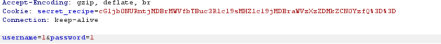

# Cookie Monster Secret Recipe #
 
## Overview ##
 
Score: 50
Category: Web Exploitation
 
## Description ##  

Cookie Monster has hidden his top-secret cookie recipe somewhere on his website. As an aspiring cookie detective, your mission is to uncover this delectable secret. Can you outsmart Cookie Monster and find the hidden recipe? You can access the Cookie Monster here and good luck  

## Hint ##  

- Sometimes, the most important information is hidden in plain sight. Have you checked all parts of the webpage?  
- Cookies aren't just for eating - they're also used in web technologies!  
- Web browsers often have tools that can help you inspect various aspects of a webpage, including things you can't see directly.  

## Tool ##
- Burp Suite

## Solution ##
First I check for the page source and found nothing. Seems like we have to do something with cookie.  
Use burp suite with intercept on, notice the cookie: 

This is a base64 encoded cookie. Decrypt it and we got the flag:  
```bash
└─$ echo "cGljb0NURntjMDBrMWVfbTBuc3Rlcl9sMHZlc19jMDBraWVzXzZDMkZCN0YzfQ" | base64 --decode
picoCTF{c00k1e_m0nster_l0ves_c00kies_6C2FB7F3}base64: invalid input
```