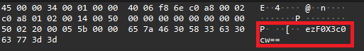

# Ph4nt0m 1ntrud3r #
 
## Overview ##
 
Score: 50
Category: Forensics
 
## Description ##  

A digital ghost has breached my defenses, and my sensitive data has been stolen! 😱💻 Your mission is to uncover how this phantom intruder infiltrated my system and retrieve the hidden flag.  
To solve this challenge, you'll need to analyze the provided PCAP file and track down the attack method. The attacker has cleverly concealed his moves in well timely manner. Dive into the network traffic, apply the right filters and show off your forensic prowess and unmask the digital intruder!  
Find the PCAP file here Network Traffic PCAP file and try to get the flag.  
## Hint ##  

- Filter your packets to narrow down your search.
- Attacks were done in timely manner.
- Time is essential

## Tool ##
- Wireshark

## Solution ##
This is a simple pcap CTF challenge. Pay attention to the end of the payload. Take the first packet for example:  

We can see a base64 encoded message. Decode it and we will see the first part of the flag:  
```bash
└─$ echo "ezF0X3c0cw==" | base64 --decode
{1t_w4s
```  
Keep doing the same and we got the flag.  
Flag: picoCTF{1t_w4snt_th4t_34sy_tbh_4r_d1065384}